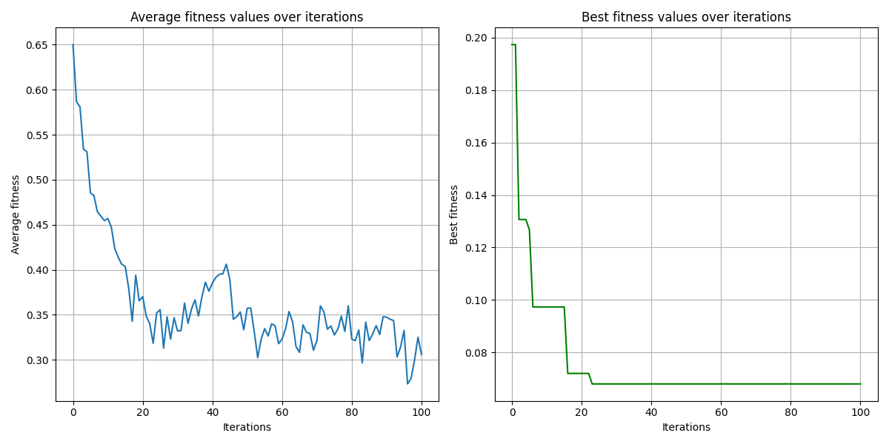
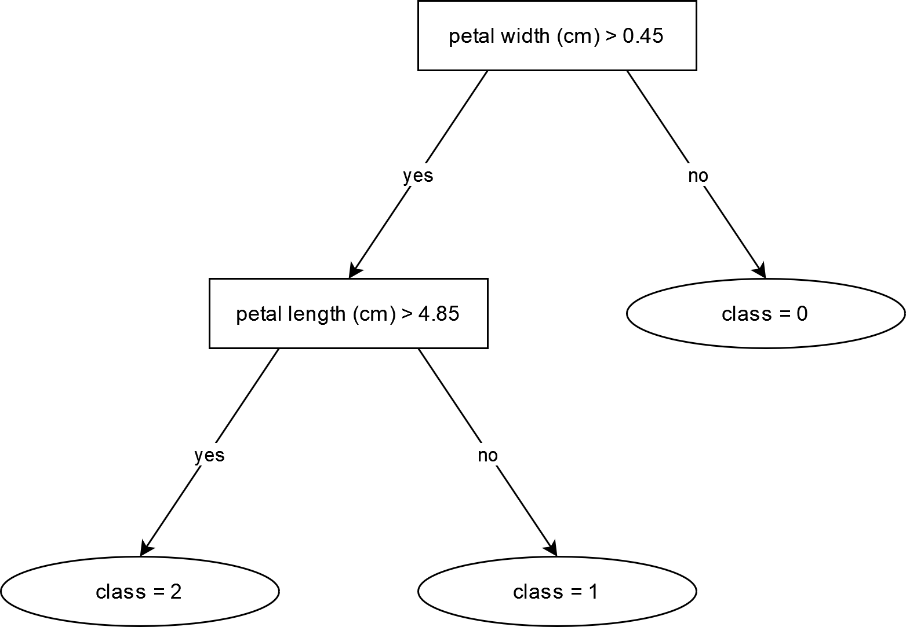

# Summary


# Statement of need

The following example shows how to perform classification of the iris dataset using the GATree package. The iris dataset is a well-known dataset in the machine learning community, often used for testing and benchmarking classification algorithms. The dataset consists of 150 samples of iris flowers, each with four features: sepal length, sepal width, petal length, and petal width. The samples belong to one of the three classes: setosa, versicolor, and virginica. The goal is to classify the samples into the correct class based on the four features.

```python
from sklearn.datasets import load_iris
from sklearn.model_selection import train_test_split
from sklearn.metrics import accuracy_score
from gatree import GATree

# Load the iris dataset as DataFrame
iris = load_iris()
X = pd.DataFrame(iris.data, columns=iris.feature_names)
y = pd.Series(iris.target, name='target')

# Split the dataset into training and testing sets
X_train, X_test, y_train, y_test = train_test_split(X, y, test_size=0.2, random_state=123)

# Create and fit the GATree classifier
gatree = GATree(n_jobs=16, random_state=123)
gatree.fit(X=X_train, y=y_train, population_size=100, max_iter=100)

# Make predictions on the testing set
y_pred = gatree.predict(X_test)

# Evaluate the accuracy of the classifier
accuracy = accuracy_score(y_test, y_pred)
print(f'Accuracy: {accuracy:.2f}')
```

In this example, we load the iris dataset and split it into training and testing sets. Next, we create an instance of the GATree classifier and define its parameters, such as the number of jobs to run in parallel and the random state for reproducibility. We then fit the classifier to the training data using a population size of 100 and a maximum of 100 iterations. Finally, we make predictions on the testing set and evaluate the accuracy of the classifier. The GATree classifier uses a genetic algorithm to evolve and optimize the decision tree structure for the classification task. This configuration achieves an accuracy of 0.93 on the testing set, demonstrating the effectiveness of the GATree package for classification tasks.

\autoref{fig:fitness_plot} depicts the average fitness value at each iteration of the genetic algorithm for the iris dataset, demonstrating how the algorithm converges towards an optimal solution.

{ width=50% }

\autoref{fig:decision_tree} shows the final decision tree obtained by the GATree classifier after fitting it to the iris dataset.

{ width=60% }

# References
