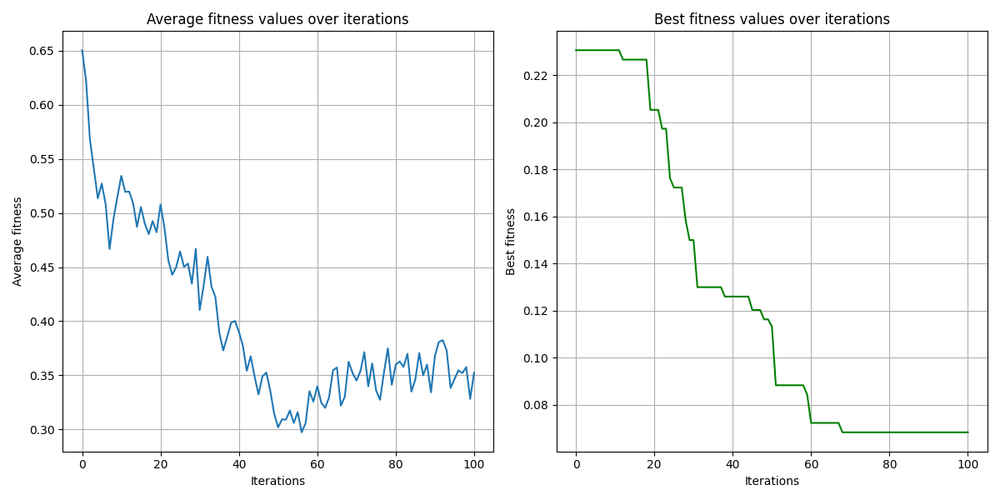
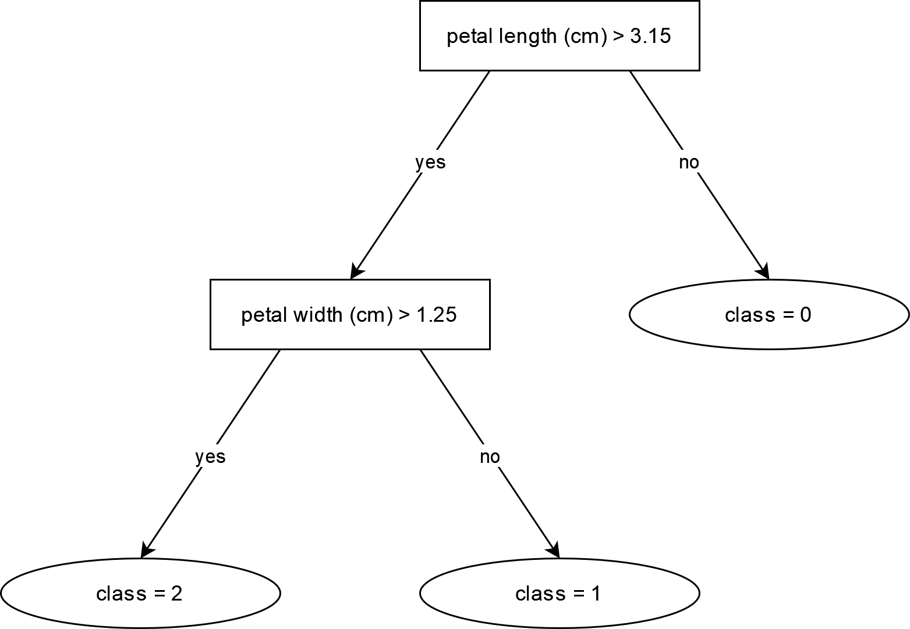

# Summary

_GATree_ is a Python library that simplifies the way decision trees are constructed and optimised for classification machine learning tasks. Leveraging the principles of genetic algorithms, _GATree_ allows for the dynamic evolution of decision tree structures, providing a flexible and powerful tool for machine learning practitioners. Unlike traditional decision tree algorithms that follow a deterministic path based on statistical models or information theory, _GATree_ introduces an evolutionary process where selection, mutation, and crossover operations guide the development of optimised trees. This method enhances the adaptability and performance of decision trees and opens new possibilities for addressing complex classification problems. _GATree_ stands out as a user-friendly, highly customisable solution, enabling users to tailor fitness functions and algorithm parameters to meet specific project needs, whether in academic research or practical applications.

# Overview

At the heart of _GATree_'s methodology lies the integration of genetic algorithms with decision tree construction, a process inspired by natural evolution [@koza1990concept]. This evolutionary approach begins with the random generation of an initial population of decision trees, each evaluated for their fitness[^1] in solving a given supervised task on the training data. Fitness evaluation typically considers factors such as classification accuracy and tree complexity, striving for a balance that rewards both the quality of decisions and the generalisability of the decisions [@bot2000application; @barros2012survey].

[^1]: Fitness is the estimation of the quality of the individual decision trees, which determines whether a decision tree survives into the next generation or not.

{ width=90% }

Following the principles of natural selection, trees that perform better are more likely to contribute to the next generation, either through direct selection or by producing offspring via crossover and mutation operations. Crossover involves the exchange of genetic material (i.e., tree nodes or branches) between two parent trees, while mutation introduces random changes to a tree's structure, promoting genetic diversity within the population. This iterative process, presented in \autoref{fig:ga}, of selection, crossover, and mutation continues across generations, with the algorithm converging towards more effective decision tree solutions over time.

# Statement of need

The development of decision tree classifiers has long been a focal point in machine learning due to their interpretability and efficacy in various machine learning tasks. Traditional algorithms, however, often fall short when dealing with complex data structures or require extensive fine-tuning to avoid overfitting or underfitting. _GATree_ addresses these challenges by introducing an evolutionary approach to decision tree optimisation, allowing for a more nuanced exploration of the solution space than is possible with conventional methods [@RIVERALOPEZ2022101006; @karakativc2018building].

This evolutionary strategy ensures that _GATree_ can adaptively fine-tune decision trees, exploring a broader range of potential solutions and dynamically adjusting to achieve optimal performance. Such flexibility is precious in fields where classification tasks are complex, and data can exhibit varied and unpredictable patterns. Furthermore, _GATree_'s ability to customise fitness functions allows for incorporating domain-specific knowledge into the evolutionary process, enhancing the relevance and quality of the resulting decision trees.

Even though there are existing Python libraries that use various meta-heuristic approaches to from machine learning tree models (i.e., _gplearn_[^2], tinyGP[^3] and _TensorGP_ [@baeta2021tensorgp]), they use symbolic regression and not decision trees. In the broader context of machine learning and data mining, _GATree_ represents a significant advancement, offering a novel solution to the limitations of existing libraries. By integrating the principles of genetic algorithms with decision tree construction, _GATree_ not only enhances the adaptability and performance of these classifiers but also provides a rich platform for further research and development in evolutionary computing and its applications in machine learning.

[^2]: \url{https://github.com/trevorstephens/gplearn}
[^3]: \url{https://github.com/moshesipper/tiny_gp}

_GATree_, a Python library with a modular and extensible architecture, comprised of two classes: _GATree_ and _Node_. The _GATree_ class is responsible for the genetic algorithm by utilising operator classes, such as _Selection_ (with optional elitism), _Crossover_, and _Mutation_. The _Node_ class handles the decision tree structure and its operations. The library is user-friendly and highly customisable - users can easily define custom fitness functions[^4] and other parameters to meet their needs. It is implemented to be compatible with the de-facto standard _scikit-learn_ machine learning library; thus, the main methods of use (i.e., _fit()_ and _predict()_) are present in _GATree_. The following example shows how to perform classification of the _iris_ dataset using the _GATree_ library.

[^4]: The default fitness function is calculated as the combination of accuracy on the test set (preferring better/higher accuracy) and the tree size (preferring smaller, more generalisable trees).

```python
import pandas as pd
from sklearn.datasets import load_iris
from sklearn.model_selection import train_test_split
from sklearn.metrics import accuracy_score
from gatree import GATree

# Load the iris dataset
iris = load_iris()
X = pd.DataFrame(iris.data, columns=iris.feature_names)
y = pd.Series(iris.target, name='target')

# Split the dataset into training and testing sets
X_train, X_test, y_train, y_test = train_test_split(
    X, y, test_size=0.2, random_state=10)

# Create and fit the GATree classifier
gatree = GATree(n_jobs=16, random_state=32)
gatree.fit(X=X_train, y=y_train, population_size=100, max_iter=100)

# Make predictions on the testing set
y_pred = gatree.predict(X_test)

# Evaluate the accuracy of the classifier
print(accuracy_score(y_test, y_pred))
```

In this example, we load the iris dataset and split it into training and testing sets. Next, we create an instance of the _GATree_ classifier and define its parameters, such as the number of jobs to run in parallel and the random state for reproducibility. We then fit the classifier to the training data using a population size of 100 and a maximum of 100 iterations. Finally, we make predictions on the testing set and evaluate the accuracy of the classifier. The _GATree_ classifier uses a genetic algorithm to evolve and optimise the decision tree structure for the classification task. This configuration achieves an accuracy of 100% on the testing set, demonstrating the effectiveness of GATree for classification tasks.

{ width=90% }

\autoref{fig:fitness_plot} provides a comprehensive visualisation of the genetic algorithm's progress on the _iris_ dataset. The line graph on the left showcases the average fitness value[^5] of each decision tree in the population across iterations, offering insight into the algorithm's overall performance over time. We can observe the most significant improvement in the average fitness value in the first 50 iterations. We can see a slight decline in average fitness values after the 50th iteration, indicating getting stuck in the local optimum while building the decision trees. The slight variations in the final iterations indicate that the population is still changing due to crossover and mutation. However, the average quality of the decision trees in the population stays roughly the same. On the right half, a similar line graph displays the best fitness value[^6] at each iteration, providing a more detailed view of the algorithm's progress. The graph shows that the best fitness value improves rapidly in the first 30 iterations. The best decision tree is unaffected by evolving local optimums around the 70th iteration as the average decision tree does but remains near the global optimum, mainly due to the elitism operator.

[^5]: The average fitness is the actual average value of all the fitness values of the entire population.
[^6]: The best fitness is only the one fitness value - the one from the best individual in the population.

\autoref{fig:decision_tree} shows the final decision tree obtained by the _GATree_ classifier after fitting it to the _iris_ dataset.

{ width=70% }

The fitness function can be customised to suit the specific requirements of the classification task. For example, we can define a custom fitness function that considers the decision tree's size, penalising larger trees to encourage simplicity and interpretability. The following example demonstrates defining and using a custom fitness function with the _GATree_ classifier.

```python
# Custom fitness function
def fitness_function(root):
    return 1 - accuracy_score(root.y_true, root.y_pred) + (0.05 * root.size())

# Create and fit the GATree classifier
gatree = GATree(fitness_function=fitness_function, n_jobs=16, random_state=10)
```

# References
